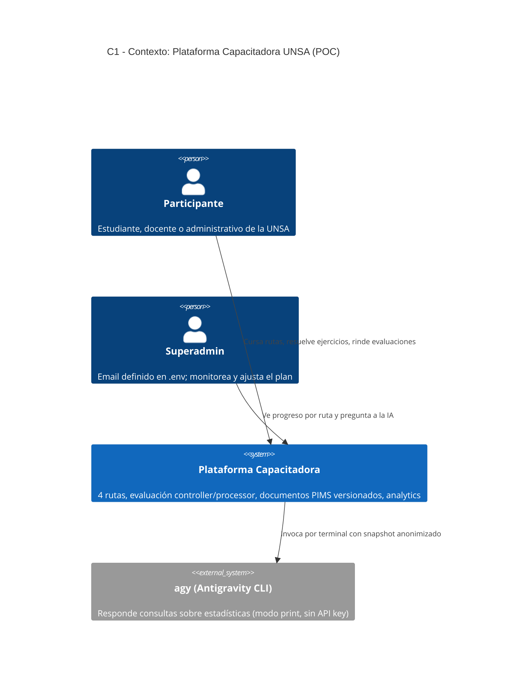

# C4 — Nivel 1: Contexto

```mermaid
C4Context
  title C1 - Contexto: Plataforma Capacitadora UNSA (POC)
  Person(learner, "Participante", "Estudiante, docente o administrativo de la UNSA")
  Person(admin, "Superadmin", "Email definido en .env; monitorea y ajusta el plan")
  System(app, "Plataforma Capacitadora", "4 rutas, evaluación controller/processor, documentos PIMS versionados, analytics")
  System_Ext(agy, "agy (Antigravity CLI)", "Responde consultas sobre estadísticas (modo print, sin API key)")
  Rel(learner, app, "Cursa rutas, resuelve ejercicios, rinde evaluaciones")
  Rel(admin, app, "Ve progreso por ruta y pregunta a la IA")
  Rel(app, agy, "Invoca por terminal con snapshot anonimizado")
```

Todos los datos de la UNSA son **ficticios** (POC).
