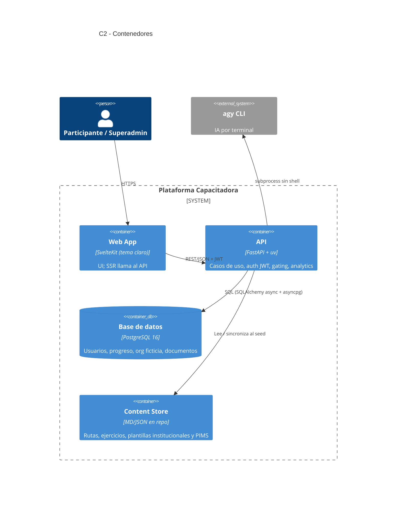

# C4 — Nivel 2: Contenedores

```mermaid
C4Container
  title C2 - Contenedores
  Person(user, "Participante / Superadmin")
  System_Boundary(sys, "Plataforma Capacitadora") {
    Container(web, "Web App", "SvelteKit (tema claro)", "UI; SSR llama al API")
    Container(api, "API", "FastAPI + uv", "Casos de uso, auth JWT, gating, analytics")
    ContainerDb(db, "Base de datos", "PostgreSQL 16", "Usuarios, progreso, org ficticia, documentos")
    Container(content, "Content Store", "MD/JSON en repo", "Rutas, ejercicios, plantillas institucionales y PIMS")
  }
  System_Ext(agy, "agy CLI", "IA por terminal")
  Rel(user, web, "HTTPS")
  Rel(web, api, "REST/JSON + JWT")
  Rel(api, db, "SQL (SQLAlchemy async + asyncpg)")
  Rel(api, content, "Lee / sincroniza al seed")
  Rel(api, agy, "subprocess sin shell")
```

Puertos de desarrollo: web 5173, API 8000, Postgres 5433 (host).
